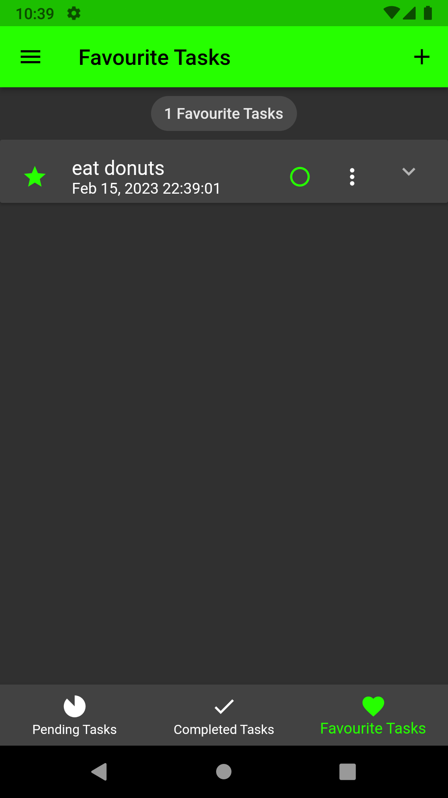

# FlutterToDoApp

An application written in <b>Flutter</b> that allows user to create a to-do list.  
The application was written to improve my flutter programming skills and to learn how to use the <b>Bloc pattern</b> with a <b>Hydrated Block</b>.

 
The application allows the user to customize their theme by choosing a dark or light mode and the main color. The selected theme will be saved even after reopening the application. The user can add his tasks, save them in favorites, mark them as finished, and move them to the bin and delete them.  

## Table of contents:
* [Technologies](#technologies)
* [Illustrations](#illustrations)

## Technologies
Project is created with: 
* Dart
* Futter
* Bloc
* Hydrated bloc
* Fluttertoast
* Intl
* Path provider
* Day night swither
* flutter_colorpicker
* fluttertoast

## Illustrations

 
 
 
 
 
 
 
 
 
 
 
 
 
 
 
 
 
 
 
 
 
 
 
 

